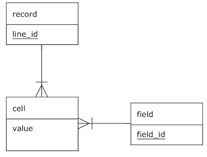

# CSV FORMAT 

## Data Structure:
### Model:

###: Instance Data

## Specification:
Below is the specification of the csv file format taken from the [RFC 4180 standard specification](https://tools.ietf.org/html/rfc4180):

> 
>1.  Each record is located on a separate line, delimited by a line
>       break (CRLF).  For example:  
>       aaa,bbb,ccc CRLF  
>       zzz,yyy,xxx CRLF   
>   2.  The last record in the file may or may not have an ending line  
>       break.  For example: 
>       aaa,bbb,ccc CRLF 
>       zzz,yyy,xxx  
>   3.  There maybe an optional header line appearing as the first line
>       of the file with the same format as normal record lines.  This
>       header will contain names corresponding to the fields in the file
>       and should contain the same number of fields as the records in
>       the rest of the file (the presence or absence of the header line
>       should be indicated via the optional "header" parameter of this
>       MIME type).  For example:  
>       field_name,field_name,field_name CRLF 
>       aaa,bbb,ccc CRLF 
>       zzz,yyy,xxx CRLF  
>   4.  Within the header and each record, there may be one or more
>       fields, separated by commas.  Each line should contain the same
>       number of fields throughout the file.  Spaces are considered part
>       of a field and should not be ignored.  The last field in the
>       record must not be followed by a comma.  For example:  
>       aaa,bbb,ccc  
>   5.  Each field may or may not be enclosed in double quotes (however
>       some programs, such as Microsoft Excel, do not use double quotes
>       at all).  If fields are not enclosed with double quotes, then
>       double quotes may not appear inside the fields.  For example:  
>       "aaa","bbb","ccc" CRLF 
>       zzz,yyy,xxx  
>   6.  Fields containing line breaks (CRLF), double quotes, and commas
>       should be enclosed in double-quotes.  For example:  
>       "aaa","b CRLF 
>       bb","ccc" CRLF 
>       zzz,yyy,xxx  
>   7.  If double-quotes are used to enclose fields, then a double-quote
>       appearing inside a field must be escaped by preceding it with
>       another double quote.  For example:  
>       "aaa","b""bb","ccc"  