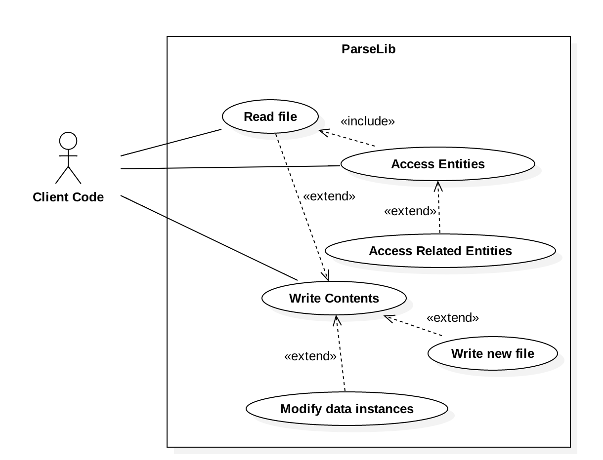

# CommonCpp
This repository is a set of libraries which holds everyday tasks which a developer such as myself might not want to write over and over again.

1. ParseLib
2. LoggerLib
3. MessageLib

## ParseLib
A primitive document access library.  A set of abstract read/write procedures which simplify setup of new file format specifications.  

### Architectural Description:
1. [Requirements](https://github.com/lmsorenson/CommonCpp/blob/master/libraries/ParseLib/docs/requirements.md#parselib-requirements---v1) 
2. [Context View](https://github.com/lmsorenson/CommonCpp/blob/master/libraries/ParseLib/README.md#context) 
3. [Functional View](https://github.com/lmsorenson/CommonCpp/blob/master/libraries/ParseLib/README.md#functional-view) 

## LoggerLib
This lib has not yet been designed.

## MessageLib
This lib has not yet been designed.
