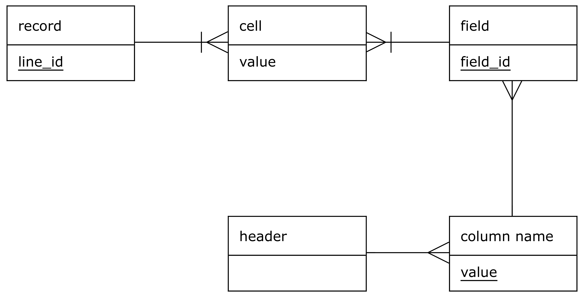

# CSV FORMAT 

## Data Structure:
### Model:

### Instance Data

## Specification:
Below is the specification of the csv file format taken from the [RFC 4180 standard specification](https://tools.ietf.org/html/rfc4180):

<ol>
<li>
    

        Each record is located on a separate line, delimited by a line
        break (CRLF).  For example:
    

    

       aaa,bbb,ccc CRLF  
       zzz,yyy,xxx CRLF 
    

</li>
<li>
    

        The last record in the file may or may not have an ending line
        break.  For example:
    

    

       aaa,bbb,ccc CRLF 
       zzz,yyy,xxx
    

</li>
<li>
    

        There maybe an optional header line appearing as the first line
        of the file with the same format as normal record lines.  This
        header will contain names corresponding to the fields in the file
        and should contain the same number of fields as the records in
        the rest of the file (the presence or absence of the header line
        should be indicated via the optional "header" parameter of this
        MIME type).  For example:  
    

    

       field_name,field_name,field_name CRLF 
       aaa,bbb,ccc CRLF 
       zzz,yyy,xxx CRLF  
    

</li>
<li>
    

        Within the header and each record, there may be one or more
        fields, separated by commas.  Each line should contain the same
        number of fields throughout the file.  Spaces are considered part
        of a field and should not be ignored.  The last field in the
        record must not be followed by a comma.  For example:  
    

    

        aaa,bbb,ccc  
    

</li>
<li>
    

        Each field may or may not be enclosed in double quotes (however
        some programs, such as Microsoft Excel, do not use double quotes
        at all).  If fields are not enclosed with double quotes, then
        double quotes may not appear inside the fields.  For example:  
    

    

        "aaa","bbb","ccc" CRLF 
        zzz,yyy,xxx  
    

</li>
<li>
    

        Fields containing line breaks (CRLF), double quotes, and commas
        should be enclosed in double-quotes.  For example:  
    

    

        "aaa","b CRLF 
        bb","ccc" CRLF 
        zzz,yyy,xxx  
    

</li>
<li>
    

        If double-quotes are used to enclose fields, then a double-quote
        appearing inside a field must be escaped by preceding it with
        another double quote.  For example:  
    

    

        "aaa","b""bb","ccc"  
    

</li>
</ol>